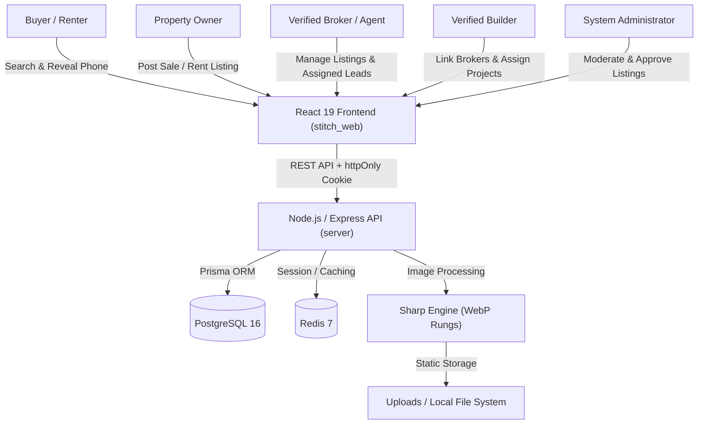
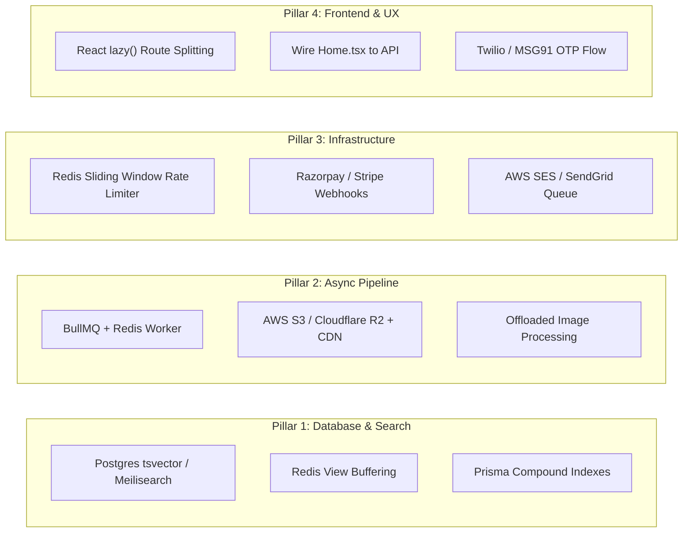

# Mature Property — System Architecture, Tech Stack & Project Documentation

> **Role & Perspective**: Senior Software Architect / Staff Engineer (6+ Years Experience)  
> **Date**: August 2026  
> **Repository**: `1codedmind/mature-property`

---

## 1. Executive Summary & Project Overview

**Mature Property** (internally code-named *PropDekho*) is an enterprise-grade property classifieds platform tailored specifically for the Indian real estate market—modeled after leading industry portals such as MagicBricks, Housing.com, and 99acres.

The platform provides a two-sided marketplace connecting property owners, buyers/renters, real estate brokers (agents), and property developers (builders).



### Core Business Models & Monetization

1. **Lead Generation Model**: Phone numbers are treated as platform assets and masked publicly. Contact information requires user authentication and is capped at 20 reveals per user per day. Every reveal generates a tracked `ContactReveal` lead.
2. **Tiered Subscription Monetization**:
   - **Free Plan**: Restricted to 3 live listings and a 5 posts/day cap.
   - **Silver Plan (₹999 / 30 Days)**: Increased limits and search priority.
   - **Gold Plan (₹2,999 / 30 Days)**: Top search ranking, home-page featured carousel placement, and Premium badges.
3. **Builder-Broker Ecosystem**: Verified builders list large-scale residential projects and delegate lead-routing rights to up to 10 verified brokers.

---

## 2. Tech Stack Specification

| Component | Framework / Technology | Version | Purpose & Technical Rationale |
| :--- | :--- | :--- | :--- |
| **Backend Runtime** | Node.js | v20+ | Asynchronous I/O, event-driven, high throughput for HTTP services. |
| **API Framework** | Express.js | v4.21 | Minimalist, mature web framework with middleware pipeline architecture. |
| **Language** | TypeScript | v5.7 | End-to-end static typing, strict null checks, enhanced developer experience. |
| **Database** | PostgreSQL | v16 | Acid-compliant relational database for structured real estate schema and spatial query capabilities. |
| **ORM** | Prisma ORM | v5.22 | Type-safe query generator, schema migrations, parameterized queries preventing SQL injections. |
| **Cache & Session** | Redis | v7 | Key-value store for session token revocation, rate-limiting counters, and aggregate query caching. |
| **Media Processing** | Sharp | v0.33 | High-performance image processing pipeline generating responsive WebP renditions (thumb, card, full). |
| **Frontend Framework** | React | v19.2 | Component-driven UI development with modern concurrency features. |
| **Build Tooling** | Vite | v8.1 | Instant hot module replacement (HMR), optimized Rollup production bundling. |
| **Styling** | Tailwind CSS | v3.4 | Utility-first CSS framework with custom container queries and forms plugins. |
| **State & Data Fetching**| TanStack Query (React Query) | v5.101 | Client-side server state management, caching, background invalidation, optimistic updates. |
| **HTTP Client** | Axios | v1.18 | Centralized API client with interceptors for credentials and automatic cookie header transmission. |
| **Routing** | React Router DOM | v7.18 | Client-side routing with role-based component guards (`Protected`). |
| **Validation** | Zod | v3.24 | Schema validation on both server requests and client form inputs. |
| **Security** | Helmet, CORS, Bcryptjs, JWT | Latest | Security headers, domain restriction, password hashing (10 salt rounds), short-lived access tokens + httpOnly refresh cookies. |

---

## 3. Server-Side vs. Client-Side Architecture

### A. Server-Side Architecture (`/server`)

The backend is built as a RESTful JSON API using an explicit Layered Architecture (Routes $\rightarrow$ Middleware $\rightarrow$ Services $\rightarrow$ Prisma Data Access Layer).

```
server/
├── prisma/
│   ├── migrations/         # Database migration history
│   └── schema.prisma       # Prisma relational data model
├── src/
│   ├── config/             # Environment & global configurations
│   ├── lib/                # Utility helpers (Prisma client, JWT tokens, Logger)
│   ├── middleware/         # Auth, Role verification, Rate limiter, Error handler
│   ├── routes/             # REST Endpoints (Auth, Listings, Inquiries, Admin, Builder)
│   ├── services/           # Core domain logic & business rules
│   ├── app.ts              # Express application factory & middleware setup
│   └── index.ts            # Entrypoint listener (Port 4000)
└── uploads/                # Static server storage for WebP images (Gitignored)
```

#### Key Server Modules & Endpoints:

| Route Path | Method | Description | Security / Guards |
| :--- | :--- | :--- | :--- |
| `/api/v1/auth/register` | `POST` | User registration (USER, AGENT, BUILDER roles) | Rate-limited, Zod validated |
| `/api/v1/auth/login` | `POST` | Authenticates user; issues JWT & httpOnly refresh cookie | Rate-limited |
| `/api/v1/auth/refresh` | `POST` | Rotates access/refresh tokens | Validates httpOnly cookie |
| `/api/v1/listings` | `GET` | Cursor-paginated listing search with complex filters | Public API (strips phone numbers) |
| `/api/v1/listings` | `POST` | Create property ad | Auth Guard, Quota check (max 3 free, 5/day) |
| `/api/v1/listings/:id/contact`| `POST` | Unlocks & logs phone number reveal (Lead creation) | Auth Guard, 20 reveals/day cap |
| `/api/v1/listings/:id/upgrade`| `POST` | Modifies plan (Free $\rightarrow$ Silver/Gold) | Auth Guard, Owner check |
| `/api/v1/builder/brokers` | `GET/POST`| Builders manage linked brokers (Max 10) | Role Guard (`BUILDER`) |
| `/api/v1/admin/listings` | `GET/PATCH`| Moderation queue approval/rejection | Role Guard (`ADMIN`), Writes `AuditLog` |

---

### B. Client-Side Architecture (`/stitch_web`)

The frontend is a single-page React application (SPA) organized into modular pages, global contexts, and role-scoped layouts.

```
stitch_web/
├── public/                 # Static web assets & favicons
├── src/
│   ├── api/                # Centralized Axios client & API endpoints
│   ├── components/         # Reusable UI components (Navbar, Footer, Cards, Toast)
│   ├── context/            # React Contexts (AuthContext for user session)
│   ├── pages/              # Application pages & sub-modules
│   │   ├── admin/          # Admin Dashboard, User & Listing Moderation
│   │   ├── agent/          # Agent Dashboard, Assigned Listings & Leads
│   │   ├── builder/        # Builder Dashboard, Broker Management & Projects
│   │   ├── AddListing.tsx  # Dynamic multi-step property creation form
│   │   ├── Home.tsx        # Homepage hero & featured properties
│   │   ├── Properties.tsx  # Search results & filter sidebar page
│   │   └── PropertyDetail.tsx # Property detail, gallery, EMI calculator & lead form
│   ├── App.tsx             # React Router v7 configuration & Protected Guards
│   └── main.tsx            # Entry point mounting React DOM
└── vite.config.ts          # Vite build parameters & dev server proxy settings
```

#### Frontend Role & Access Control Matrix:

| Role | Accessible Routes | Primary Responsibilities |
| :--- | :--- | :--- |
| **Guest / Public** | `/`, `/properties`, `/property/:id`, `/login`, `/register` | Search, view listings, calculate EMI, share properties. |
| **USER (Owner/Buyer)**| All Public + `/add-listing`, `/profile`, `/dashboard` | Post ads, manage favorites, view saved searches, unlock phone reveals. |
| **AGENT (Broker)** | All User + `/agent`, `/agent/listings`, `/agent/leads`, `/agent/analytics` | Manage assigned builder listings, process buyer leads. |
| **BUILDER** | All User + `/builder`, `/builder/projects`, `/builder/brokers`, `/builder/leads` | Manage project portfolios, link brokers, assign exclusive listings. |
| **ADMIN** | All Routes + `/admin`, `/admin/users`, `/admin/properties`, `/admin/reports` | System moderation, account verification, platform user management, audit review. |

---

## 4. Comprehensive Setup & Local Running Guide

### Prerequisites
Before getting started, ensure the following software is installed on your local environment:
- **Node.js**: `v20.0.0` or higher
- **Package Manager**: `npm` (v10+)
- **Containerization**: `Docker` & `Docker Compose` (or local PostgreSQL 16 & Redis instance)

---

### Standard Operating Procedure (Step-by-Step)

#### Step 1: Clone & Inspect Repository
```bash
git clone https://github.com/1codedmind/mature-property.git
cd mature-property
```

#### Step 2: Provision Database Infrastructure
Launch PostgreSQL and Redis services using Docker Compose:
```bash
docker compose up -d
```
*Note: This starts PostgreSQL 16 on port `5432` (credentials: `propdekho`/`propdekho`) and Redis 7 on port `6379`.*

#### Step 3: Backend API Setup & Database Migration
```bash
cd server

# Create local environment configuration file
cp .env.example .env

# Install Node dependencies
npm install

# Run database migrations to provision tables
npx prisma migrate dev

# Seed database with initial users, admin, and realistic property listings
npm run seed

# Start the Express dev server (Runs on http://localhost:4000)
npm run dev
```

#### Step 4: Frontend Web Client Setup
In a new terminal window:
```bash
cd stitch_web

# Install Node dependencies
npm install

# Start Vite development server (Runs on http://localhost:5174)
npm run dev
```

---

### Single-Command Shortcut (Root Directory)
Alternatively, you can orchestrate the entire development environment directly from the repository root:

```bash
# 1. Install root dependencies (concurrently)
npm install

# 2. Spin up Docker services
npm run db

# 3. Execute concurrently script to launch both Server & Client
npm run dev
```

---

### Demo Test Credentials

All accounts come pre-configured with the default password: `password123`

| Role | Email Address | Access & Capabilities |
| :--- | :--- | :--- |
| **System Administrator** | `admin@propdekho.local` | Full access to Moderation Queue, User Management, Verification & Audit Logs. |
| **Property Seller (User 1)** | `rahul@example.com` | Pre-seeded with active Sale & Rent listings across Bangalore/Mumbai. |
| **Property Seller (User 2)** | `priya@example.com` | Pre-seeded with active listings and incoming lead inquiries. |

---

## 5. Security Posture & Engineering Controls

As evaluated from a Senior Developer standpoint, the codebase implements robust security measures:

1. **Information Leakage Prevention**: Owner contact details are stripped from all public API serializers (`serializeListing`). Access requires authorization and enforces a hard limit of 20 reveals per user per day.
2. **Content Leakage Filter**: Title and description text is parsed with Regex during listing creation/update; any embed of phone numbers, email addresses, or external HTTP links triggers an automatic submission rejection.
3. **Session & Token Security**: Short-lived JWT access tokens (15 minutes) paired with rotating httpOnly, same-site `RefreshToken` cookies prevent token interception and XSS-based session hijacking.
4. **File Upload Hardening**: Image uploads pass through `multer` and are re-processed via `sharp` into WebP. This sanitizes malicious EXIF metadata and strips arbitrary executable script payloads.
5. **Database Injection Protection**: All queries utilize Prisma ORM parameterized statements, eliminating SQL injection vectors.
6. **Audit Traceability**: Key administrative actions (listing approvals, rejections, user bans, role adjustments) write immutable logs to the `AuditLog` table.

---

## 6. Comprehensive Audit: Technical & Architecture Gaps

As part of a senior engineering code audit, the following technical bottlenecks, functional gaps, and architectural limitations were identified across the application:

### A. Database & Query Performance Bottlenecks

| Identified Gap | Technical Root Cause | Impact on System & Scalability |
| :--- | :--- | :--- |
| **Full Table Scans on Search** | Query uses `ILIKE '%q%'` across 4 columns (`title`, `description`, `locality`, `city`) in an `OR` condition inside `listingService.ts`. | Disables B-tree index usage in PostgreSQL; forces full table scan on every search query, causing latency spikes at >10k listings. |
| **Double Querying & Count Overhead** | `search()` executes `prisma.listing.count({ where })` alongside `findMany()` on every page request. | Executes unindexed count aggregate scans twice per search request, doubling database load. |
| **Write Lock Contention on Views** | `getById()` fires an unbuffered write query `prisma.listing.update({ views: { increment: 1 } })` on every detail view. | Creates severe database lock contention on high-traffic listings, saturating PostgreSQL connection pools. |
| **Missing Compound Indexes** | Search queries filter simultaneously on `city` + `locality` + `purpose` + `propertyType` + `bedrooms` + `price`. | Index coverage is single-column only; PostgreSQL is forced to perform bitmap index scans and memory merges. |

---

### B. Backend Infrastructure & Processing Gaps

| Identified Gap | Technical Root Cause | Impact on System & Scalability |
| :--- | :--- | :--- |
| **Synchronous Event-Loop Blocking** | Image resizing in `uploads.ts` processes up to 60 images synchronously via `sharp` inside the HTTP request lifecycle. | Starves Node.js Event Loop of CPU cycles during image uploads, causing high API latency and request timeouts. |
| **Stateful Rate Limiting** | Rate limiter uses an in-memory JS `Map<string, number[]>`. | Fails in multi-container / horizontal scale deployments (K8s/PM2) because state is not shared across instances. |
| **Ephemeral File Storage** | Images & verification docs are saved to local filesystem (`/uploads`). | Breaks stateless Docker/Kubernetes container auto-scaling; files are lost when containers restart or scale out. |
| **Mock Monetization Pipeline** | `POST /listings/:id/upgrade` directly mutates subscription status without payment validation. | Lacks Razorpay/Stripe order creation, cryptographic signature verification, and idempotency handling via webhooks. |
| **Console Logger Mailer Stub** | Email notification service logs to stdout in dev mode. | No retry logic, DLQ (Dead Letter Queue), or integration with production transactional mail providers (SES/SendGrid). |

---

### C. Frontend (`stitch_web`) Performance & UX Gaps

| Identified Gap | Technical Root Cause | Impact on System & Scalability |
| :--- | :--- | :--- |
| **Monolithic JS Bundle (~2.6MB)** | All page components, admin tools, and builder modules are imported eagerly in `App.tsx`. | Slow First Contentful Paint (FCP) and Time to Interactive (TTI), particularly on mobile devices. |
| **Static Mock Pages** | `Home.tsx` and `LeadManagement.tsx` contain static hardcoded mock datasets (e.g. USD prices). | Features are disconnected from real backend endpoints (`/api/v1/meta`, `/api/v1/admin/reports`). |
| **Absence of Phone / OTP Auth** | User signup uses standard password auth without mobile number verification. | High risk of fake accounts and spam lead reveals, critical for Indian real estate portal integrity. |
| **Unoptimized Image Loading** | Image tags lack `loading="lazy"` attributes, explicit responsive sizes, or native WebP `srcset`. | Causes unnecessary network bandwidth consumption and layout shifts (CLS) on initial load. |

---

## 7. Strategic Optimization & Improvement Plan

To transition Mature Property into a production-ready, highly available enterprise platform, the following multi-pillar optimization roadmap is recommended:



---

### Implementation Blueprint & Action Items

#### 1. Database & Search Optimization
- **PostgreSQL Full-Text Search**: Replace `ILIKE` wildcard queries with a PostgreSQL `tsvector` generated column indexed with a GIN index:
  ```sql
  ALTER TABLE "Listing" ADD COLUMN text_search tsvector 
  GENERATED ALWAYS AS (to_tsvector('english', coalesce(title, '') || ' ' || coalesce(locality, '') || ' ' || coalesce(city, ''))) STORED;
  CREATE INDEX listing_text_search_idx ON "Listing" USING GIN(text_search);
  ```
- **Redis View Counter Buffering**: Write listing view increments to Redis (`INCR listing:views:<id>`) and flush to PostgreSQL in batches every 5 minutes using a scheduled cron job.
- **Compound Prisma Indexes**: Update `schema.prisma` with optimized multi-column indexes:
  ```prisma
  @@index([city, purpose, status, price])
  @@index([ownerId, plan, status])
  @@index([status, featured, createdAt])
  ```

---

#### 2. Asynchronous Job & Media Pipeline
- **Offload Heavy Image Processing**: Accept file uploads, push raw buffers to a **BullMQ** job queue backed by Redis, and return an instant `202 Accepted` response to the client.
- **Cloud Object Storage (S3 / R2)**: Replace local disk writes with direct upload streaming to AWS S3 or Cloudflare R2 using `@aws-sdk/client-s3`, served via a CloudFront CDN edge network.

---

#### 3. Frontend Optimization (`stitch_web`)
- **Route-Level Code Splitting**: Wrap non-critical routes with React `lazy()` and `Suspense`:
  ```tsx
  const AdminDashboard = lazy(() => import('./pages/admin/AdminDashboard'));
  const BuilderDashboard = lazy(() => import('./pages/builder/BuilderDashboard'));
  const AgentDashboard = lazy(() => import('./pages/agent/AgentDashboard'));
  ```
- **Connect Static Mock Pages to Real APIs**:
  - Update `Home.tsx` to fetch real aggregated metrics (`GET /api/v1/meta/summary`) and live featured listings (`GET /api/v1/listings?featured=true`).
  - Wire `admin/LeadManagement.tsx` to live report resolution endpoints (`GET /api/v1/admin/reports`).

---

#### 4. Payment Gateway & Webhook Integration
- **Two-Phase Payment Flow**:
  1. `POST /api/v1/payments/create-order`: Generates a signed Razorpay/Stripe order ID.
  2. `POST /api/v1/payments/webhook`: Listens to `payment.captured` webhooks, verifies HMAC signatures, and applies listing plan upgrades idempotently.

---

#### 5. Verification & Security Enhancement
- **OTP Phone Verification**: Integrate SMS gateway (Twilio / MSG91) to issue a 6-digit OTP during registration and prior to executing phone number reveals (`POST /listings/:id/contact`).
- **Distributed Redis Rate Limiter**: Upgrade rate-limiting middleware to use Redis atomic operations (`INCR` + `EXPIRE`), ensuring uniform rate limits across all API container replicas.

---

## 8. Summary Checklist for Production Readiness

| Domain | Action Item | commitTarget Metric / SLA | Status |
| :--- | :--- | :--- | :--- |
| **Performance** | Implement React `lazy()` Code Splitting | Initial JS Bundle < 300 KB | ⏳ Pending |
| **Search DB** | Replace `ILIKE` with Postgres GIN / FTS Index | Search Response Time < 50ms | ⏳ Pending |
| **Media** | Offload Sharp to BullMQ Worker + S3 / CDN | API Response Time < 150ms | ⏳ Pending |
| **Infra** | Move Rate Limits & Caching to Redis Store | 100% Horizontal Scalability | ⏳ Pending |
| **Monetization**| Wire Razorpay Payment Orders & Webhooks | Zero Manual Plan Overrides | ⏳ Pending |
| **Trust/Safety**| Add SMS OTP Verification on Signup & Reveals| Zero Fake User Accounts | ⏳ Pending |
| **Frontend** | Wire `Home.tsx` static mock data to REST API | Live Real-Time Homepage Data | ⏳ Pending |

